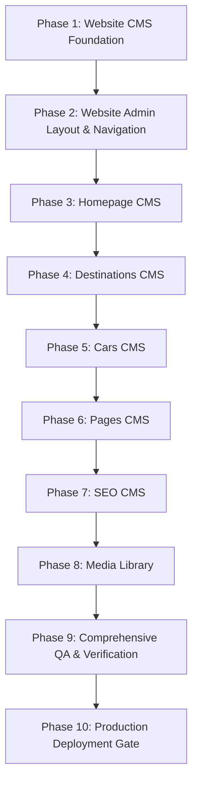

# 📜 العقد التنفيذي وخارطة الطريق الماستر لتنفيذ المنظومة
## (Master Implementation Contract & Execution Blueprint)

**الصفة الرسمية**: Chief Software Architect, Enterprise Technical Lead, Migration Director & Release Manager  
**المشروع**: منصة مساري الرقمية (`msari_web`)  
**المستند الرسمي المعتمد**: `docs/implementation/IMPLEMENTATION_CONTRACT.md`  
**الحالة الفنية**: 📜 **العقد التنفيذي المباشر والحاكم لكافة مراحل التطوير والنشر المستقبلية**

---

> [!IMPORTANT]
> **قواعد العقد التنفيذي والحوكمة الإلزامية**:
> - لا تشمل هذه الوثيقة أي كتابة كود أو تعديل ملفات برمجة أو إنشاء مجموعات حية في هذه المرحلة.
> - تُعتمد هذه الوثيقة كـ **العقد التنفيذي الموحد الوحيد** الذي سيعتمد عليه المطورون ووكلاء الـ AI مرحلة بمرحلة.
> - **مبدأ التنفيذ المرحلي**: لن يتم تنفيذ المشروع دفعة واحدة، بل يتم تنفيذ كل مرحلة (Phase) بمهمة مستقلة ولا يُسمح بالانتقال للمرحلة التالية قبل اعتماد الـ QA الفعلي للمرحلة الحالية.

---

## 📑 1. الملخص التنفيذي للمشروع (Executive Summary)

يحدد هذا العقد التنفيذي خارطة الطريق الشاملة وخطة التحول الهيكلي لإنشاء **نظام إدارة محتوى الموقع (Website CMS)** وتطوير لوحة التحكم المستقلة، مع المحافظة التامة والكاملة على بيانات واستقرار **تطبيق الجوال (Application Data)** المربوط على Firebase Firestore.

المرجع المعماري والتنفيذي الوحيد الحاكم لهذا العقد هو المجموعات التوثيقية المعتمدة بـ `/docs/architecture/` و `/docs/deployment/`.

---

## 📊 2. تشخيص وضع المشروع الحالي (Current Project Status)

| التصنيف الفني | الحالة والخدمات في وضعها الحالي |
| :--- | :--- |
| 🟢 **مكتمل (Completed)** | - محرك الفنادق المحلية والغرف والحجوزات والمستخدمين المربوط بـ Firestore.<br>- محرك الطيران والفنادق العالمية المربوط بالـ APIs المباشرة.<br>- نظام المصادقة بـ NextAuth v5 مع JWT Strategy.<br>- مكونات الهوية البصرية الموحدة وتصميم الواجهات.<br>- توثيق المعمارية العامة واعتماديات النظام. |
| 🟡 **غير مكتمل (Incomplete)** | - لوحة تحكم الوجهات والمدن (تقتصر على الاسم والصورة فقط دون باقي المحتوى والمعالم والـ SEO).<br>- ربط نصوص الهيرو والمميزات والشركاء بنظام إدارة محتوى ديناميكي. |
| 🔴 **غير منفذ (Not Implemented)** | - لوحة تحكم ومجموعات خزن خدمات أسطول السيارات والتوصيل.<br>- نظام إدارة صفحات الموقع والصفحات الثابتة (من نحن / الخصوصية / الشروط).<br>- نظام إدارة الـ SEO والميتا تاجز لكل صفحة.<br>- مكتبة الأصول والصور الموحدة (Media Library). |
| ⌛ **مؤجل (Deferred)** | - ربط تحليلات النقرات وتتبع سلوك الزوار (Analytics Engine).<br>- تفعيل نظام التنبيهات المتقدم والـ Web Push Notifications. |
| 📦 **متبقي غير مستخدم (Legacy)** | - ملف الماكيت التأسيسي `src/lib/prisma.ts` ومكتبات Prisma (معزولة وغير مستدعات في الكود التشغيلي الحالي). |
| 🛠️ **حالات مؤقتة (Placeholder/useState)** | - بيانات أسطول السيارات المحفوظة بحالات `useState` بالذاكرة بـ [admin/cars/page.tsx](file:///d:/Dev/projects/msari_web/src/app/[locale]/admin/cars/page.tsx#L9).<br>- بيانات معالم ووصف المدن المخزنة بملف `src/data/destinations.ts`. |

---

## 🚫 3. النطاقات المحظور لمسها إطلاقاً (Explicit Non-Goals)

لتجنب أي تداخل أو انحدار في وظائف المنظومة، يُحظر منعاً باتاً تعديل أو لمس النطاقات التالية أثناء كافة مراحل التنفيذ:

- 🛑 **بيانات ومجموعات تطبيق الجوال بـ Firebase**: (`hotels`, `rooms`, `bookings`, `users`, `bank_accounts`, `ads`).
- 🛑 **خدمات الفنادق المحلية والحجوزات الحية وشاشات حجز المستخدمين**.
- 🛑 **نظام المصادقة الحالي ومصرحات الأمان بـ `adminGuard`**.
- 🛑 **الـ APIs الحالية والمباشرة للفنادق العالمية والطيران**.
- 🛑 **نظام الهوية البصرية (Design System) والألوان الأساسية المعتمدة**.
- 🛑 **خط المبادئ والـ SEO المحفوظ في المعمارية المعتمدة**.

---

## 🗄️ 4. خطة ترحيل وإنشاء مجموعات (Firestore Migration Plan)

المجموعات المخصص إنشاؤها ببادئة `web_` بداخل **Firebase Firestore** لخدمة الـ Website CMS حصراً:

1. **`web_settings`**: تخزين إعدادات الموقع، البريد، الهاتف، الواتساب، وروابط التواصل.
2. **`web_homepage`**: تخزين نصوص وصور قسم الهيرو، العناوين الرئيسية، وصندوق الشركاء.
3. **`web_sections`**: تخزين بيانات ومميزات قسم لماذا مساري والخدمات.
4. **`web_destinations`**: تخزين البيانات التحريرية الشاملة للمدن (الوصف، المناخ، الثقافة، المعالم، FAQ، و SEO).
5. **`web_cars`**: تخزين أسطول وسيارات التوصيل للمطارات والتنقل بين المدن، الفئات، والأسعار.
6. **`web_car_bookings`**: تخزين طلبات وحجوزات السيارات الخاصة عبر الموقع.
7. **`web_pages`**: تخزين صفحات المحتوى الثابت (من نحن، سياسة الخصوصية، شروط الاستخدام).
8. **`web_seo_pages`**: تخزين عناوين الميتا، الأوصاف، والـ OG Images المخصصة لكل مسار بداخل الموقع.
9. **`web_banners`**: تخزين بنرات وإعلانات الموقع التسويقية.
10. **`web_partners`**: تخزين قائمة الشركاء، الشعارات، ونصوص الانضمام.
11. **`web_faq`**: تخزين الأسئلة الشائعة وتصنيفاتها.
12. **`web_testimonials`**: تخزين تقييمات وآراء العملاء بـ الصفحة الرئيسية.

---

## 🎛️ 5. موديولات لوحة تحكم الموقع المخطط بناؤها (Website Admin Modules)

الموديولات المعتمد بناؤها تحت المسار `/admin/website/*`:

```
Website Admin Modules
├── 📊 Dashboard Overview
├── 🖼️ Homepage & Hero Manager
├── 📍 Destination CMS Manager
├── 🚗 Cars & Fleet Manager
├── 📑 Custom Pages Manager
├── 🔍 SEO & Metadata Manager
├── ⚙️ Website Settings Manager
├── 🤝 Partners & Banners Manager
├── ❓ FAQ Manager
└── 💬 Testimonials Manager
```

---

## 🗺️ 6. خارطة الطريق الماستر للتنفيذ (Master Implementation Roadmap)

تتكون خارطة الطريق التنفيذية من **10 مراحل مستقلة ومحددة**:



### 📍 تفاصيل المراحل الـ 10 للتنفيذ:

---

#### 🔹 Phase 1: Website CMS Foundation & Infrastructure
- **الهدف**: تأسيس طبقة الخدمات والـ Repositories والـ Actions الخاصة بالـ Web CMS.
- **الملفات المتوقع تعديلها**: لا يوجد (تأسيس جديد).
- **الملفات الجديدة**: `src/actions/website-cms.ts`, `src/services/website-cms.service.ts`.
- **المجموعات المطلوب إنشاؤها بـ Firestore**: `web_settings`.
- **الخدمات المطلوبة**: `WebsiteCmsService`.
- **مستوى الخطورة**: 🟢 منخفض (Low).
- **الاعتماديات (Dependencies)**: `firebase-admin`, `action-guard`.
- **التعقيد المقدر (Complexity)**: 🟢 بسيط.

---

#### 🔹 Phase 2: Website Admin Core Layout & Navigation
- **الهدف**: إنشاء التخطيط والمسارات الموحدة للوحة تحكم الموقع (`/admin/website/*`).
- **الملفات المتوقع تعديلها**: `src/components/admin/AdminSidebar.tsx`.
- **الملفات الجديدة**: `src/app/[locale]/admin/website/layout.tsx`, `src/app/[locale]/admin/website/page.tsx`.
- **المجموعات المطلوب إنشاؤها بـ Firestore**: لا يوجد.
- **الخدمات المطلوبة**: `AdminSidebarNavigation`.
- **مستوى الخطورة**: 🟢 منخفض (Low).
- **الاعتماديات**: Phase 1.
- **التعقيد المقدر**: 🟢 بسيط.

---

#### 🔹 Phase 3: Homepage & Hero CMS
- **الهدف**: جعل محتوى الصفحة الرئيسية، الهيرو، وقسم لماذا مساري قابلاً للإدارة الكاملة من اللوحة.
- **الملفات المتوقع تعديلها**: `src/components/home/HeroSection.tsx`, `src/components/home/WhyMsari.tsx`.
- **الملفات الجديدة**: `src/app/[locale]/admin/website/homepage/page.tsx`, `src/components/admin/website/HomepageAdminClient.tsx`.
- **المجموعات المطلوب إنشاؤها بـ Firestore**: `web_homepage`, `web_sections`.
- **الخدمات المطلوبة**: `HomepageCmsService`.
- **مستوى الخطورة**: 🟡 متوسط (Medium).
- **الاعتماديات**: Phase 1 & Phase 2.
- **التعقيد المقدر**: 🟡 متوسط.

---

#### 🔹 Phase 4: Destinations Details CMS
- **الهدف**: توسيع لوحة الوجهات لتخزين الوصف التاريخي، المناخ، المعالم، و FAQ بكل مدينة بـ Firestore وإلغاء الاعتماد على `destinations.ts`.
- **الملفات المتوقع تعديلها**: `src/app/[locale]/destinations/[slug]/page.tsx`, `src/services/city.service.ts`.
- **الملفات الجديدة**: `src/app/[locale]/admin/website/destinations/[id]/page.tsx`, `src/components/admin/website/DestinationDetailAdminClient.tsx`.
- **المجموعات المطلوب إنشاؤها بـ Firestore**: `web_destinations`.
- **الخدمات المطلوبة**: `DestinationCmsService`.
- **مستوى الخطورة**: 🟡 متوسط (Medium).
- **الاعتماديات**: Phase 3.
- **التعقيد المقدر**: 🟡 متوسط.

---

#### 🔹 Phase 5: Cars & Transport Fleet CMS
- **الهدف**: تحويل خدمة أسطول السيارات إلى خدمة دائمية بـ Firestore وحفظ الحجوزات.
- **الملفات المتوقع تعديلها**: `src/app/[locale]/cars/page.tsx`, `src/app/[locale]/admin/cars/page.tsx`.
- **الملفات الجديدة**: `src/actions/cars-cms.ts`, `src/services/car-cms.service.ts`, `src/components/admin/website/CarsAdminClient.tsx`.
- **المجموعات المطلوب إنشاؤها بـ Firestore**: `web_cars`, `web_car_bookings`.
- **الخدمات المطلوبة**: `CarCmsService`.
- **مستوى الخطورة**: 🔴 عالي (High).
- **الاعتماديات**: Phase 4.
- **التعقيد المقدر**: 🔴 معقد.

---

#### 🔹 Phase 6: Custom Pages & Content CMS (About, Privacy, Terms)
- **الهدف**: إدارة محتوى الصفحات الثابتة (من نحن، سياسة الخصوصية، الشروط) من لوحة تحكم الموقع.
- **الملفات المتوقع تعديلها**: `src/app/[locale]/about/page.tsx`, `src/app/[locale]/privacy/page.tsx`, `src/app/[locale]/terms/page.tsx`.
- **الملفات الجديدة**: `src/app/[locale]/admin/website/pages/page.tsx`, `src/components/admin/website/PagesAdminClient.tsx`.
- **المجموعات المطلوب إنشاؤها بـ Firestore**: `web_pages`, `web_faq`, `web_testimonials`.
- **الخدمات المطلوبة**: `PageCmsService`.
- **مستوى الخطورة**: 🟢 منخفض (Low).
- **الاعتماديات**: Phase 3.
- **التعقيد المقدر**: 🟢 بسيط.

---

#### 🔹 Phase 7: SEO & Metadata CMS Manager
- **الهدف**: إدارة العناوين الوصفية والميتا تاجز والـ OG Images لكل مسار بداخل المنصة.
- **الملفات المتوقع تعديلها**: `src/app/[locale]/layout.tsx`, `src/app/[locale]/page.tsx`.
- **الملفات الجديدة**: `src/app/[locale]/admin/website/seo/page.tsx`, `src/components/admin/website/SeoAdminClient.tsx`, `src/actions/seo-cms.ts`.
- **المجموعات المطلوب إنشاؤها بـ Firestore**: `web_seo_pages`.
- **الخدمات المطلوبة**: `SeoCmsService`.
- **مستوى الخطورة**: 🟡 متوسط (Medium).
- **الاعتماديات**: Phase 6.
- **التعقيد المقدر**: 🟡 متوسط.

---

#### 🔹 Phase 8: Media Library & Asset Management Integration
- **الهدف**: توحيد رفع واسترجاع أصول الصور لـ CMS بـ Firebase Storage.
- **الملفات المتوقع تعديلها**: `src/actions/storage.ts`.
- **الملفات الجديدة**: `src/components/admin/website/MediaLibraryModal.tsx`.
- **المجموعات المطلوب إنشاؤها بـ Firestore**: لا يوجد (تستخدم Storage).
- **الخدمات المطلوبة**: `MediaStorageService`.
- **مستوى الخطورة**: 🟢 منخفض (Low).
- **الاعتماديات**: Phase 7.
- **التعقيد المقدر**: 🟢 بسيط.

---

#### 🔹 Phase 9: Comprehensive QA, Integration & Regression Verification
- **الهدف**: إجراء فحص شامل للرابط بين الـ CMS المحدث والصفحات العامة والتأكد من انعدام الـ Regressions.
- **الملفات المتوقع تعديلها**: لا يوجد (فحص وتأكيد فقط).
- **الملفات الجديدة**: `scratch/verify_cms_integration.js`.
- **المجموعات المطلوب إنشاؤها بـ Firestore**: لا يوجد.
- **الخدمات المطلوبة**: `RuntimeVerificationSuite`.
- **مستوى الخطورة**: 🟡 متوسط (Medium).
- **الاعتماديات**: Phase 1 to Phase 8.
- **التعقيد المقدر**: 🟡 متوسط.

---

#### 🔹 Phase 10: Production Deployment Gate & Release Approval
- **الهدف**: تجميع واختبار حزمة الإنتاج وتمرير النشر على البيئة المؤقتة Staging ثم النطاق الرسمي.
- **الملفات المتوقع تعديلها**: لا يوجد.
- **الملفات الجديدة**: `docs/deployment/RELEASE_NOTES_v1.0.md`.
- **المجموعات المطلوب إنشاؤها بـ Firestore**: لا يوجد.
- **الخدمات المطلوبة**: `DeploymentGateChecker`.
- **مستوى الخطورة**: 🔴 عالي (High).
- **الاعتماديات**: Phase 9.
- **التعقيد المقدر**: 🟡 متوسط.

---

## 🧪 7. خطة الفحص والتحقق الأثناء التشغيل (Runtime Validation Plan)

تتضمن خطة التحقق 5 مستويات فحص حتمية لكل مرحلة:

1. **اختبار الوحدات (Unit Testing)**: فحص سلامة الـ DTOs والـ Validation Schemas بـ Zod.
2. **اختبار التكامل (Integration Testing)**: فحص قراءة وكتابة الـ Server Actions مع Firestore.
3. **الفحص اليدوي (Manual QA)**: اختبار الواجهات بـ المتصفح والتأكد من انعكاس التعديل لحظياً.
4. **التحقق من زمن التشغيل (Runtime Verification)**: تشغيل سكريبت فحص حالة الـ HTTP 200 OK لكافة المسارات المحدثة.
5. **فحص الانحدار (Regression Testing)**: التأكد التام من عدم تأثر الفنادق المحلية وحجوزات التطبيق بأي شكل.

---

## 🚪 8. بوابة واعتمادات النشر (Deployment Gate)

قبل السماح بالنشر النهائي لأي مرحلة في الإنتاج، يجب استيفاء وبثبات الشروط الخمسة التالية:

- [ ] **Clean Production Build**: تجميع خالي تماماً من الأخطاء عبر `npm run build`.
- [ ] **Zero Regressions**: تأكيد عدم تأثر أي وظيفة سابقة بالمشروع.
- [ ] **Full Manual & Automated QA**: نجاح كافة الفحوصات بـ 100%.
- [ ] **Successful Staging Verification**: نجاح اختبار المعاينة على الدومين المؤقت.
- [ ] **Updated Documentation**: تحديث الوثائق المعمارية ورسائل الإصدار بـ `docs/`.

---

## 📋 9. قائمة التنفيذ الماستر التفصيلية (Master Execution Checklist)

تتكون هذه القائمة من عناصر مستقلة وقابلة للتنفيذ والاعتماد بنداً بنداً:

### 📍 Phase 1: Foundation
- [ ] إنشاء `src/services/website-cms.service.ts`
- [ ] إنشاء `src/actions/website-cms.ts`
- [ ] إنشاء Firestore Document `web_settings`
- [ ] فحص اختبار `WebsiteCmsService`
- [ ] اعتماد Phase 1

### 📍 Phase 2: Admin Core Layout
- [ ] إنشاء `src/app/[locale]/admin/website/layout.tsx`
- [ ] إنشاء `src/app/[locale]/admin/website/page.tsx`
- [ ] تحديث القائمة الجانبية بـ `AdminSidebar.tsx`
- [ ] فحص وتأكيد الملاحة باللوحة
- [ ] اعتماد Phase 2

### 📍 Phase 3: Homepage CMS
- [ ] إنشاء Firestore Collection `web_homepage`
- [ ] إنشاء `src/components/admin/website/HomepageAdminClient.tsx`
- [ ] ربط `HeroSection.tsx` بـ `web_homepage`
- [ ] ربط `WhyMsari.tsx` بـ `web_homepage`
- [ ] فحص الـ QA والتأكد من انعدام الـ Regression
- [ ] اعتماد Phase 3

### 📍 Phase 4: Destinations CMS
- [ ] إنشاء Firestore Collection `web_destinations`
- [ ] إنشاء `src/components/admin/website/DestinationDetailAdminClient.tsx`
- [ ] ربط `src/app/[locale]/destinations/[slug]/page.tsx` بـ Firestore
- [ ] إلغاء استدعاء الملف المحلي `destinations.ts`
- [ ] فحص وتأكيد صفحة المدينة والمعالم والـ SEO
- [ ] اعتماد Phase 4

### 📍 Phase 5: Cars CMS
- [ ] إنشاء Firestore Collection `web_cars`
- [ ] إنشاء Firestore Collection `web_car_bookings`
- [ ] إنشاء `src/actions/cars-cms.ts`
- [ ] تحويل `src/app/[locale]/admin/cars/page.tsx` للاتصال بـ Firestore
- [ ] ربط واجهة السيارات العامة `src/app/[locale]/cars/page.tsx` بـ Firestore
- [ ] فحص وتأكيد حجوزات وأسطول السيارات
- [ ] اعتماد Phase 5

### 📍 Phase 6: Pages CMS
- [ ] إنشاء Firestore Collection `web_pages`
- [ ] إنشاء `src/components/admin/website/PagesAdminClient.tsx`
- [ ] ربط صفحة من نحن `about/page.tsx` بـ `web_pages`
- [ ] ربط صفحة الخصوصية `privacy/page.tsx` بـ `web_pages`
- [ ] ربط صفحة الشروط `terms/page.tsx` بـ `web_pages`
- [ ] فحص وتأكيد المحتوى الثابت
- [ ] اعتماد Phase 6

### 📍 Phase 7: SEO CMS
- [ ] إنشاء Firestore Collection `web_seo_pages`
- [ ] إنشاء `src/actions/seo-cms.ts`
- [ ] إنشاء `src/components/admin/website/SeoAdminClient.tsx`
- [ ] ربط الـ Metadata الديناميكي بـ Layout والصفحات
- [ ] فحص وتأكيد الميتا تاجز والـ Sitemap
- [ ] اعتماد Phase 7

### 📍 Phase 8: Media Library
- [ ] إنشاء `src/components/admin/website/MediaLibraryModal.tsx`
- [ ] ربط رفع الأصول بـ Firebase Storage
- [ ] فحص واختبار اختيار وتصفح الصور
- [ ] اعتماد Phase 8

### 📍 Phase 9: Comprehensive QA
- [ ] تشغيل سكريبت الـ Verification لكافة مسارات الـ CMS والموقع
- [ ] فحص انعدام التأثير على فنادق الجوال وحجوزات التطبيق
- [ ] إعداد تقرير الـ QA النهائي
- [ ] اعتماد Phase 9

### 📍 Phase 10: Production Deployment
- [ ] تشغيل `npm run build` وتأكيد خلو البناء من أي أخطاء
- [ ] النشر والتحقق على الدومين المؤقت (Staging)
- [ ] اعتماد بوابات النشر وتفعيل الإصدار الرسمي
- [ ] الإغلاق التام واكتمال المشروع 🎉

---

**تم بحمد الله اعتماد وتوثيق العقد التنفيذي الماستر للمنظومة.**
